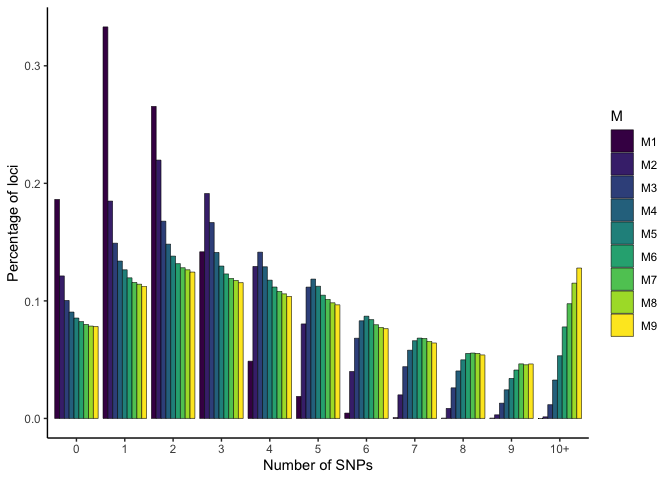
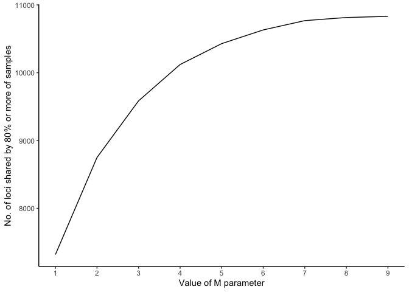
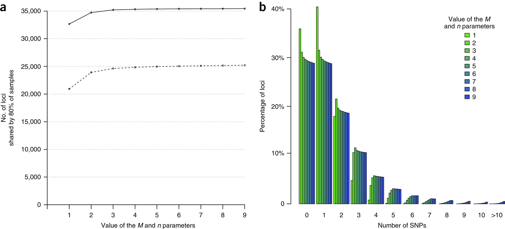

Oyster Stacks RAD Test
================

## Practicing with Stacks

These graphs represent are made following the procedure laid out here:
<https://www.nature.com/articles/nprot.2017.123#Sec27>, in order to
assess the parameters for doing a full stacks allignment with a lot of
samples.

## Graphs

Data wrangling link for cheat sheet:
<http://www.rstudio.com/wp-content/uploads/2015/02/data-wrangling-cheatsheet.pdf>

<!-- --><!-- -->

## Compare these to the graphs used by STACKS creators

Sourced from
here:<https://www.nature.com/articles/nprot.2017.123/figures/2>
 These figures were interpreted as
showing that there are only marginal increases to loci by increasing M
past 4, and M=4 is sufficient to stabilize the proportions of loci with
1–5 SNPs. Therefore they maintained M=4 as their parameter for the rest
of the analysis.

Examining my data with the same lens, I think my loci shared increases
plateau around 7 or 8. 7 and 8 are consistent with eachother, and
generally with the others in % of loci. I think that for the number of
loci, I should proceed with M = 8
