Map Spisula Sites
================

## Intro and Practice

The code used here for reference is from Harmony, Honggang
(<https://github.com/hzz0024/BioinfoTools>), and
<https://geocompr.robinlovelace.net/adv-map.html>.

My goal is to make a map of the spisula sample sites from 2012 to 2020,
with number of samples coded by the size of the circle and subspecies
coded by color.

``` r
tm_shape(nz) +
    tm_fill() 
map_nz1 = tm_shape(nz) + tm_polygons()
#add elevation
#map_nz1 = map_nz +
#  tm_shape(nz_elev) + tm_raster(alpha = 0.7) #need to define nz_elevation
#representing nz territorial waters
nz_water = st_union(nz) %>% st_buffer(22200) %>% 
  st_cast(to = "LINESTRING")
map_nz2 = map_nz1 +
  tm_shape(nz_water) + tm_lines()
#add peaks
map_nz3 = map_nz2 +
  tm_shape(nz_height) + tm_dots()  #but why don't I need to define nz_height
tmap_arrange(map_nz1, map_nz2, map_nz3)
```

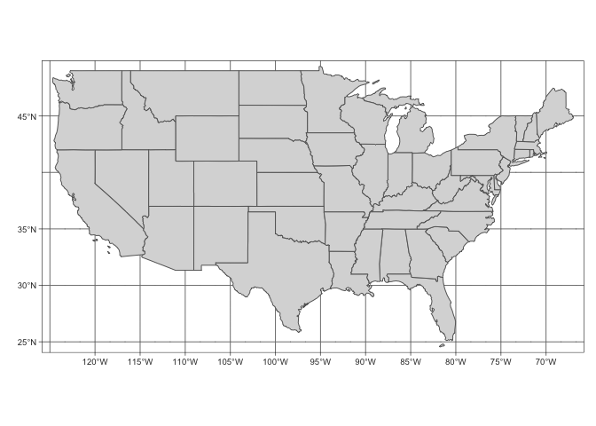<!-- -->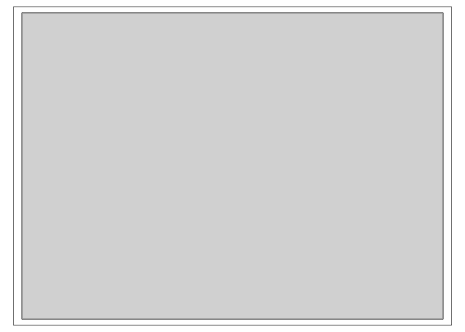<!-- -->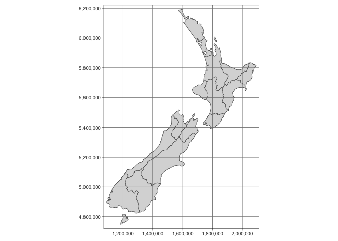<!-- -->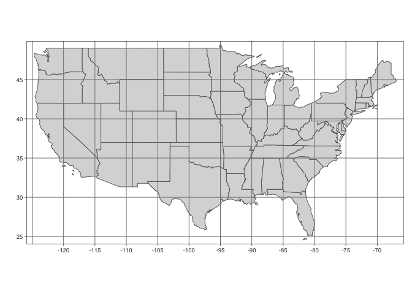<!-- --><!-- -->

``` r
library(sf)
library(raster)
library(dplyr)
library(spData)
library(tmap)
library(ggplot2)
library(tidyverse)
```

    ## ── Attaching packages ─────────────────────────────────────── tidyverse 1.3.0 ──

    ## ✓ tibble  2.1.3     ✓ purrr   0.3.3
    ## ✓ tidyr   1.0.2     ✓ stringr 1.4.0
    ## ✓ readr   1.3.1     ✓ forcats 0.4.0

    ## ── Conflicts ────────────────────────────────────────── tidyverse_conflicts() ──
    ## x tidyr::extract() masks raster::extract()
    ## x dplyr::filter()  masks stats::filter()
    ## x dplyr::lag()     masks stats::lag()
    ## x dplyr::select()  masks raster::select()

``` r
#Show full map
tm_shape(us_states) + tm_polygons() + tm_graticules() 
```

<!-- -->

``` r
#create my bounds with st_bbox, piped into st as sfc
eastcoast=st_bbox(c(xmin = -85, xmax = -65,
                      ymin = 30, ymax = 45)) %>% st_as_sfc()
#use those bounds under bbox variable within tm_Shape
tm_shape(us_states, bbox = eastcoast) + tm_polygons() + tm_graticules() 
```

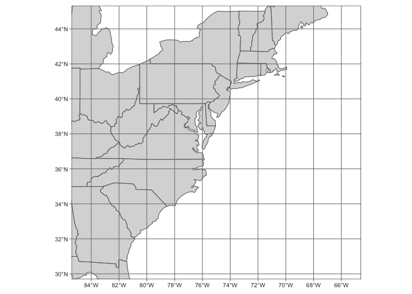<!-- -->

``` r
#tm_polygons = tm_fill + tm_borders
#color and formatting
tm_shape(us_states, bbox = eastcoast) +  
  tm_fill(col = "grey99") + tm_borders(col="grey30") + tm_layout(bg.color = "grey90") +
  tm_graticules(col="white")
```

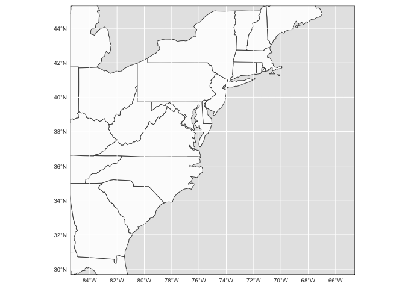<!-- -->
\#\# Importting
Data

``` r
spisloc <- read_csv("/Users/hannah/gitHub/Spisula/Work/map_spisula_input.csv")

spisloc %>%
  ggplot() +
  geom_point(aes(x=Lat, y=Lon))
```

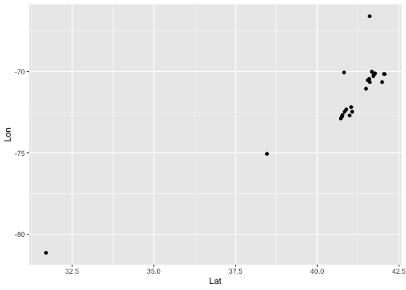<!-- -->

``` r
#Add on to map
#example from: https://www.r-bloggers.com/2019/10/make-a-map-of-your-study-site-with-tmap/
sitescoral <- read.csv(url("https://raw.githubusercontent.com/cbrown5/BenthicLatent/master/data-raw/JuvUVCSites_with_ReefTypes_16Jun2016.csv"))
sites <- st_as_sf(sitescoral, coords = c("coordx", "coordy"))
#making the coordinate reference system the same
#land <- st_read(dsn ="LandPoly")
#st_crs(sites) <- st_crs(land)

  
#my data
spissites <- st_as_sf(spisloc, coords = c("Lon","Lat")) #LON FIRST - if confused, view whole world
#making the coordinate reference system the same
st_crs(spissites) <- st_crs(us_states)


library(RColorBrewer)
#plotting
tm_shape(us_states, bbox=eastcoast) +  
  tm_fill(col = "grey99") + tm_borders(col="grey30") + tm_layout(bg.color = "grey90") +
  tm_grid(col="white") +
  tm_shape(spissites) +  
  tm_symbols(size = 0.9, col = "Species", alpha = 0.5,  palette = "Set2") 
```

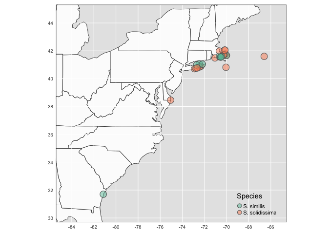<!-- -->

``` r
#For the future: to reverse a pallette, easy as: palette = rev("Set2")
```

### Final Adjustments

Possible iterations of the graph: +Where color or shape indicate species
+Whiter background +Where size is number of samples taken at the site
+With nantuket similis offset

``` r
eastcoast=st_bbox(c(xmin = -85, xmax = -65,
                      ymin = 30, ymax = 45)) %>% st_as_sfc()
#Base
map_1 <- tm_shape(us_states, bbox=eastcoast) +  
  tm_fill(col = "grey99") + tm_borders(col="grey30") + tm_layout(bg.color = "grey90") +
  tm_grid(col="white") +
  tm_shape(spissites) +  
  tm_symbols(size = 1, col = "Species", alpha = 0.5,  palette = "Set2", border.alpha = 0.2)
#Size = number of samples
map_2 <- tm_shape(us_states, bbox=eastcoast) +  
  tm_fill(col = "grey99") + tm_borders(col="grey30") + tm_layout(bg.color = "grey90") +
  tm_grid(col="white") +
  tm_shape(spissites) +  
  tm_symbols(size = "Samples", col = "Species", alpha = 0.5,  palette = "Set2", border.alpha = NA)
#Also changed border alpha to default
#All are too small!!

#By shapes
map_3 <- tm_shape(us_states, bbox=eastcoast) +  
  tm_fill(col = "grey99") + tm_borders(col="grey30") + tm_layout(bg.color = "grey90") +
  tm_grid(col="white") +
  tm_shape(spissites) +  
  tm_symbols(size = 1, shape = "Species",  alpha = 0.7,  col= "Samples", palette = "Reds")

#Try to change size and jitter (for sites with both)
map_4 <- tm_shape(us_states, bbox=eastcoast) +  
  tm_fill(col = "grey99") + tm_borders(col="grey30") + tm_layout(bg.color = "grey90") +
  tm_grid(col="white") +
  tm_shape(spissites) +  
  tm_symbols(size = "Samples", col = "Species", alpha = 0.7,  palette = "Set2",
             scale = 2.5, jitter = 0.01) 
#default icon.scale=3 ,  icon.scale = 9 has no change
#default legend.max.symbol.size = 0.8 , on its own legend.max.symbol.size = 3 has no effect
#THIS ONE: default scale=1, changing this makes them all bigger

#Circles not filled in
map_5 <- tm_shape(us_states, bbox=eastcoast) +  
  tm_fill(col = "grey99") + tm_borders(col="grey30") + tm_layout(bg.color = "grey90") +
  tm_grid(col="white") +
  tm_shape(spissites) +  
  tm_symbols(size = "Samples", alpha = 1, col = "Species",shape=1, border.lwd = 2, palette = "Set2",
             scale = 2.5, jitter = 0.01) 
#Do so by choosing a different shape (hollow circle) rather than trying to set border color to variable

#map_1 at larger scale
map_6 <- tm_shape(us_states, bbox=eastcoast) +  
  tm_fill(col = "grey99") + tm_borders(col="grey30") + tm_layout(bg.color = "grey90") +
  tm_grid(col="white") +
  tm_shape(spissites) +  
  tm_symbols(size = 1, jitter= 0.01 ,col = "Species",  palette = "Set2",alpha = 0.6,border.lwd = 0.7,  border.alpha = 0.5, scale = 1.5)

#tmap_arrange(map_1,map_2,map_3)

#Base
map_1
```

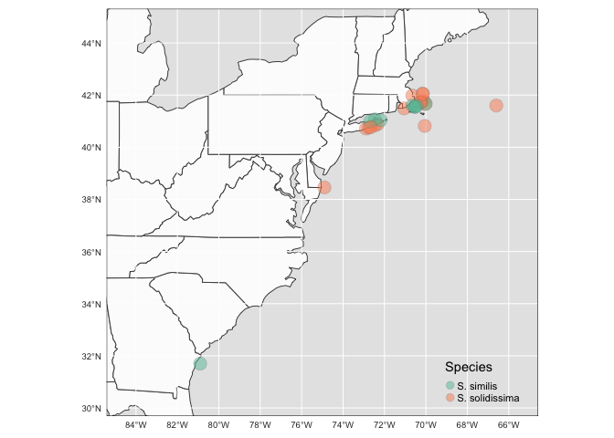<!-- -->

``` r
#By size too small
map_2
```

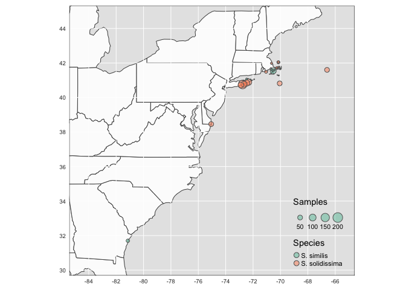<!-- -->

``` r
#By shape with quantity as color
map_3
```

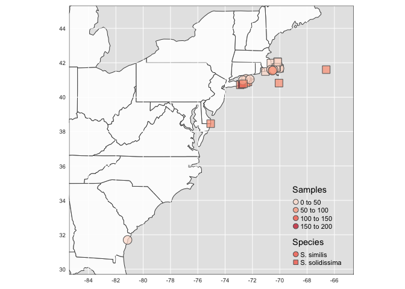<!-- -->

``` r
#Scaled up by size and miniscule jitter
map_4
```

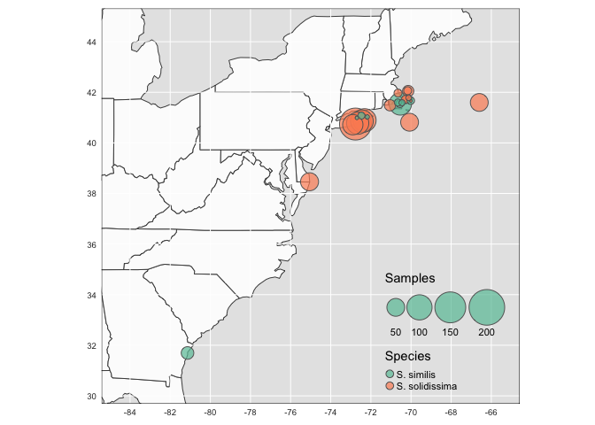<!-- -->

``` r
#Circles scaled and jitter
map_5
```

<!-- -->

``` r
#Base redone with scaling and jitter
map_6
```

<!-- -->
